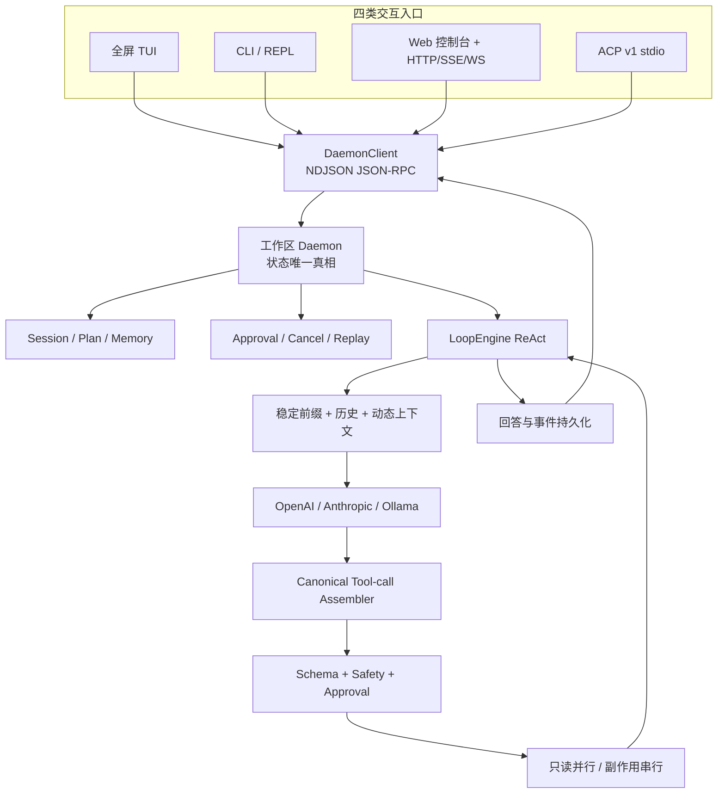

<p align="center">
  
</p>

<p align="center">
  
  
  
  
  
</p>

<p align="center">
  <strong>一个面向个人开发者的、本地优先的 AI 编码 Agent。</strong><br>
  用一个工作区 daemon 统一管理会话、上下文、计划、审批、工具执行和事件恢复。
</p>

<p align="center">
  <a href="#为什么是-my-agent">为什么</a> ·
  <a href="#核心能力">核心能力</a> ·
  <a href="#系统如何工作">架构</a> ·
  <a href="#快速开始">快速开始</a> ·
  <a href="#安全边界">安全边界</a> ·
  <a href="./docs/agent-system.html">完整系统说明</a>
</p>

---

## 为什么是 my-agent

很多 Agent 原型能“调用一次工具”，却很难稳定处理真实编码任务：长任务会失控、连接断开会丢状态、多个窗口会串会话、危险命令缺少统一边界，用户也看不出 Agent 究竟还在运行还是已经卡住。

`my-agent` 把这些问题收拢到一个 Rust 单 crate 中：

- **一个状态真相**：每个工作区只有 daemon 持有运行时状态，所有入口共享同一协议。
- **四类交互入口**：全屏 TUI、CLI、本地 HTTP/WebSocket、标准 ACP v1 stdio。
- **可靠的长任务循环**：主任务没有固定轮次硬上限，但有进度检查、重复检测、工具失败熔断和显式取消。
- **可恢复、可审计**：稳定 session、append-only JSONL、活动事件回放、按 session/request 过滤日志。
- **个人版的安全克制**：灾难命令硬拒，高风险操作审批，Cron 无人值守时安全拒绝。

> 想先看完整流程图和功能全景？打开 [项目系统说明](./docs/agent-system.html)。

## 终端体验

<p align="center">
  
</p>

TUI 默认继承当前终端主题，也可启用内置 `dark` / `light` 语义色板。它不是简单的日志滚屏：

- 层级化 transcript、Unicode 字素安全编辑（组合字符/emoji）、多行输入、历史草稿和 daemon 持久发送队列投影。
- 工具调用默认聚合；`Ctrl+T` 锚定最近一条原 Query，在原对话中内联展开详情。
- 输入 `/` 实时显示内置命令及简介；继续输入可按前缀过滤，`↑/↓` 选择、`Tab` 补全。
- 多个并发 turn 按真实阶段聚合状态；模型等待、流式输出、工具执行期间持续显示不确定进度动画。
- 审批、完成、失败、取消和连接中断都有明确终态；滚离底部时提示新消息。
- 页眉持续显示本地 Web 地址；`/web` 幂等启动或复用控制台，并打开当前工作目录对应的 Agent 工作台。
- 快捷键处理与帮助共用一份 action keymap；`Ctrl+/` 查看帮助，`Ctrl+C` 取消当前请求，`/resume` 恢复历史会话。

## 核心能力

| 能力 | 当前实现 |
|---|---|
| **多 Provider** | OpenAI Chat Completions、Anthropic Messages、Ollama；协议差异封装在适配器内，统一输出严格 tool-call 生命周期事件；达到 token 上限的工具批次整批拒绝并安全重试。 |
| **8 个内置工具** | `read_file`、`write_file`、`edit_file`、`exec`、`remember`、`recall_memory`、`plan`、`sub_agent`。 |
| **计划与子 Agent** | 可重写、可持久化任务计划；`sub_agent` 支持单任务及最多 4 个独立只读任务并发，每个子任务使用全新历史、受限工具和最多 15 轮预算，不能递归派生；取消主请求时同步取消子任务。 |
| **图片与 PDF** | PNG/JPEG/WebP 可作为视觉内容块；PDF 在本地抽取最多 50 页文字；不支持时给出明确降级。 |
| **三条记忆链路** | 独立 session JSONL、60%/85% 两级上下文摘要、带 TTL 的关键词/中文 bigram 长期记忆。 |
| **Skill** | `.my-agent/skills/*.md` 使用 YAML frontmatter 与 semver，按当前请求稳定排序并按需加载正文。 |
| **Cron / Heartbeat** | interval/五段 cron、独立 session、有限指数退避、无人值守安全拒绝；heartbeat 不调用模型。 |
| **MCP stdio** | 本地 server 握手、工具发现、动态桥接、默认审批、错误隔离和子进程清理。 |
| **多窗口隔离** | 每个 TUI/REPL/ACP 窗口拥有独立 session；历史、活动请求、审批、取消和订阅互不串线。 |
| **Web Agent 工作台** | 默认首页专注实际开发：可浏览并切换本地工作目录、新建或继续 Agent 任务，按 WebSocket 实时查看思考与正文增量；正文支持安全 Markdown（含表格），思考结束后自动折叠，并处理审批或取消；工具调用与输出默认折叠、仍可展开查看。每个目录连接独立 daemon 与安全边界。 |
| **Session 查看** | 独立页面搜索当前工作目录下由 Web、TUI、CLI、ACP 产生的 Session；列表按本地日期分组，可折叠/展开“今天”等日期，详情按页加载对话与链路，支持继续加载，超大单条内容会显示截断提示而不会阻塞整页。 |
| **权限模式** | Web 与 TUI 共享三档工作区权限：请求批准、帮我批准、完全访问权限；切换命令为 `/permissions [request|risk|full]`，完全访问仍保留灾难性命令硬拦截。 |
| **可观测性** | 每 Session 的结构化 `.trace` 与 daemon 日志同时保留 round、Provider 首增量/总耗时、工具耗时及 `session_id/request_id` 关联。 |

## 系统如何工作



一次请求的核心链路：

1. 任一入口把请求交给 `DaemonClient`，入口本身不创建 Provider 或工具运行时。
2. daemon 以 SQLite 事务准入消息、登记 run 与队列项；同一 session 的下一条消息等待 writer permit。
3. 上下文按“稳定前缀 → 历史 → 动态信息”组装，超过水位时进行两级压缩。
4. Provider 流式返回文本或工具调用，唯一 assembler 严格拼装参数并 fail-closed。
5. 整批工具先做 JSON Schema 与安全决策，再按只读并行、副作用串行执行。
6. 结果用原始 `tool_call_id` 回填；最终回答落盘，并投影为各入口需要的事件格式。

## 快速开始

### 1. 构建

需要 Rust `1.88+`。当前进程间通信使用 Unix Domain Socket，支持 macOS 和 Linux。

```bash
git clone https://github.com/wangyichen666/agent-daemon.git
cd agent-daemon
cargo build --release
```

### 2. 配置 Provider

首次使用也可以直接运行 `my-agent serve`，打开 Web 工作台右上角设置，在“模型配置”中保存一次；配置会写入用户级文件（默认 `~/.config/my-agent/config.json`，可用 `MY_AGENT_CONFIG` 或 `XDG_CONFIG_HOME` 调整），后续新终端自动复用。文件权限为用户私有，API key 不会出现在 Session 或接口返回中。

可在配置文件中加入 `"fallback_profile_ids": ["备用配置ID"]`，按顺序指定备用模型。每个 run 准入时冻结主模型、备用顺序、超时和重试策略；运行中的 `/models` 切换只影响之后准入的 run。冻结快照只保存配置 ID、模型和服务地址摘要，不保存密钥。若 daemon 重启后排队 run 所需配置已被删除或改变，该 run 会明确失败，不会悄悄改用新配置。

OpenAI 兼容服务示例：

```bash
export API_TYPE='openai-chat'
export OPENAI_API_KEY='你的密钥'
export OPENAI_BASE_URL='https://api.deepseek.com'
export MODEL_NAME='deepseek-chat'
```

Anthropic Messages 使用同一组通用环境变量，将 `API_TYPE` 改为 `anthropic-messages`，并填写对应的 API URL、密钥和模型名。

本地 Ollama 不需要 API Key：

```bash
export API_TYPE='ollama'
export MODEL_NAME='qwen3'
# OPENAI_BASE_URL 未设置时默认 http://127.0.0.1:11434
```

### 3. 检查并启动

```bash
./target/release/my-agent config check

# 默认进入全屏 TUI，并自动拉起当前工作区 daemon
./target/release/my-agent
```

也可以安装到 Cargo bin：

```bash
cargo install --path .
my-agent
```

## 入口与命令

| 命令 | 用途 |
|---|---|
| `my-agent` / `my-agent tui` | 启动全屏终端界面。 |
| `my-agent chat` | 启动普通 REPL。 |
| `my-agent chat "检查项目"` | 发起一次性请求。 |
| `my-agent serve --bind 127.0.0.1:8787` | 提供多工作区 Web Agent 工作台、Session 查看、OpenAI 兼容 HTTP/SSE 与 `/ws`。 |
| `my-agent editor` | 启动标准 ACP v1 stdio server。 |
| `my-agent status` | 查看当前工作区 daemon 与日志路径。 |
| `my-agent sessions` | 列出稳定 session、摘要和运行状态。 |
| `my-agent logs --lines 100` | 查看最近 daemon 日志。 |
| `my-agent logs --session … --request …` | 按 session/request 精确排障。 |
| `my-agent stop` | 优雅停止当前工作区 daemon。 |

交互入口共享以下 Slash 命令：

```text
/help      /status    /sessions   /resume [编号|ID]
/new       /cancel    /skill      /cron
/mcp       /ping      /dogfood    /web       /exit
/permissions [request|risk|full]
/models [编号|ID]
/run <run_id>
```

`/models` 不带参数时列出已保存配置；例如 `/models 2` 或 `/models deepseek` 会切换活动模型。Web 设置支持保存多个 OpenAI 兼容、Anthropic Messages 和 Ollama 配置。运行中的 run 保持其准入时的路由快照。

在 TUI 输入 `/dogfood` 会在 session 文件所在目录生成 `dogfood-<session>.log`，其中包含当前 session 的原始 LLM/ReAct 对话（用户消息、助手回复、工具调用参数和工具输出），以及按 `session_id` 筛选的 daemon 全链路日志。TUI 只显示生成文件的绝对路径，不把日志正文塞入对话区。

在 TUI 输入 `/web`：若控制台尚未启动，会在 `MY_AGENT_WEB_ADDR`（默认 `127.0.0.1:8787`）拉起 Web 服务；若已启动则直接复用。打开的 URL 会携带当前工作目录。Web 首页默认是 Agent 工作台，可通过服务端目录选择器切换项目；每个项目按 canonical 路径连接自己的 daemon、Session 与 SafetyPolicy。Session 查看作为独立页面按页读取全部对话与结构化链路，底部可继续加载，避免大 Session 超过协议帧上限。

<details>
<summary><strong>HTTP / SSE / WebSocket 示例</strong></summary>

```bash
curl http://127.0.0.1:8787/v1/chat/completions \
  -H 'content-type: application/json' \
  -d '{"model":"你的模型名","messages":[{"role":"user","content":"检查当前项目"}]}'
```

- `/v1/chat/completions` 支持普通 JSON 和 OpenAI 风格 SSE。
- `/ws` 首帧发送 `{"type":"connect","token":"...","workspace":"/absolute/project"}`，服务端校验并绑定该工作目录后，后续使用全双工 JSON-RPC 2.0。
- `/api/directories` 为 Web 工作目录选择器提供经过鉴权的只读目录浏览；工作目录必须存在且会在服务端 canonicalize。
- 非回环监听必须设置 `MY_AGENT_API_TOKEN`。
- HTTP 无法弹出终端审批，因此需要审批的操作会安全拒绝。

</details>

<details>
<summary><strong>Cron 与 MCP 配置示例</strong></summary>

Cron：

```text
/cron add nightly cron=0,2,*,*,* --retries=2 --backoff=10 检查项目并生成报告
/cron add quick interval=300 执行轻量巡检
/cron list
/cron run-now quick
/cron disable quick
/cron remove quick --confirm
```

`.my-agent/mcp.json`：

```json
{
  "mcpServers": {
    "filesystem": {
      "command": "npx",
      "args": ["-y", "@modelcontextprotocol/server-filesystem", "${WORKSPACE_ROOT}"],
      "env": {},
      "cwd": "${WORKSPACE_ROOT}"
    }
  }
}
```

保存后运行 `/mcp reload`。当前只支持可信的本地 stdio MCP server，不支持远程 streamable-http/SSE transport。

</details>

## 可靠性设计

- **严格工具装配**：乱序、重复完成、缺失参数或不完整 EOF 会整轮拒绝，不执行半批副作用。
- **受控长任务**：主任务没有固定 ReAct 轮次上限，每 50 轮检查进度；完全相同调用与结果连续 10 次才按无进展熔断。
- **失败恢复**：工具失败会回填模型修复；连续 3 次工具失败则终止并返回明确原因。
- **断线恢复**：daemon 在工作区 `.my-agent/runtime.sqlite3` 中保存 run、turn、队列、工具回执、事件序号、交互和终态。`agent.subscribe` 先回放持久事件，再接实时通知；缺口以 `resync_required` 返回 snapshot、`last_seq` 和分页游标。`run.read` / `run.events` 可在重启后查询。旧 JSONL 对话和 trace 保留。
- **不确定结果**：daemon 重启时，已启动但未确认终态的 run 标为 `unknown_after_restart`，未启动的 queued run 保留并由 daemon 恢复调度。取消发生在副作用工具开始之后时也记为未知，避免已经执行工具却确认取消。未知副作用不自动重放。可用 `/run <run_id>` 从 CLI 或 ACP 查询；WebSocket 可调用同一个 `run.read` RPC。
- **工具回执与诊断**：工具批次在执行前写入 prepared，每个调用在执行前转为 running，结束后提交 typed outcome、最多 4096 字符的预览与本地完整输出 artifact 路径。`run.tools` 查看回执；`run.audit` 对照 SQLite、JSONL、trace 与 artifact 摘要并报告分歧。JSONL 匹配仅用于诊断，不能证明 run 成功。人工核实后可用 `run.reconcile` 记录显式修复。
- **Provider 韧性**：HTTP、协议、传输和阶段超时以类型化错误记录。默认仅对限流、传输、服务端错误和部分超时做有限重试；同候选耗尽后，在本次尝试没有发布正文、thinking 或部分工具调用时才切换备用模型。连接、首语义事件、流静默和总尝试分别限时；SSE 注释、空行和 usage 不重置语义 idle 时钟。每次尝试在网络请求前入 SQLite，结束时记录错误类别、候选、TTFT、用量和终态；`run.provider_attempts` 可读回所有尝试及聚合用量。失败的 `terminal` 事件带 `provider_error_kind`；缺失的 token 字段保持 `null`。
- **平滑升级**：ready 标记记录可执行文件内容指纹；重新构建后会优雅停止旧 daemon，再使用新版本启动。
- **进程清理**：`exec` 默认 300 秒超时；取消或超时会清理整个子进程组。stdout/stderr 持续排空，每路只保留前 64 KiB；daemon 关闭时停止已登记的前台进程。

### 控制面 RPC（JSON-RPC 2.0）

| 方法 | 参数要点 | 结果 |
|---|---|---|
| `chat.send` | `message`, `session_id?`, `admission_mode?: "queue" \| "reject_if_busy"` | 完成后返回 `content/run_id/turn_id`；重复排队请求返回同一 `run_id` |
| `queue.list` / `queue.read` / `queue.remove` | `session_id`；后两者还需 `run_id` | 稳定队列项 ID、位置与状态；remove 只取消指定 queued run |
| `agent.cancel` | 优先使用 `session_id + run_id`；兼容 `request_id` | 只取消对应 run；无 session 的旧 request ID 若不唯一则冲突 |
| `interaction.list` / `interaction.read` | `session_id` / `interaction_id` | 返回 owner、kind、status、revision 和类型化 payload |
| `interaction.respond` / `interaction.reject` | `interaction_id`, `session_id`, `owner_run_id`, `revision`；respond 还需 `approved` | 先持久 claim 再唤醒；相同答案幂等，冲突答案拒绝。旧 `approval.respond` 仍可用 |
| `run.read` / `run.events` / `run.tools` / `run.audit` | `run_id`；events 可带 `after_seq/limit` | 状态、分页事件、工具回执、一致性诊断 |
| `run.provider_attempts` | `run_id` | 冻结 route、每次 Provider attempt、run 级 usage；不返回 API key 或原始上游响应 |
| `run.reconcile` | `session_id`, `run_id`, `expected_last_seq`, `status`, `evidence`；completed 需 `content` | 只修复 unknown run；校验 owner 与事件序号，记录证据摘要和人工决议 |

新客户端应保存 `run_id` 和事件 `seq`。传输断线或 HTTP 等待超时只结束本次等待；重新连接后用 `run.read`、`queue.list` 与 `agent.subscribe(after_seq)` 读取事实。审批在 daemon 重启后会标为 orphaned，原 LLM 执行体不会自动恢复。`run.reconcile` 仅供本地操作者在检查 `run.audit` 后使用，不会自动重放工具或修改旧 JSONL。`steer`、强沙箱、可恢复子 Agent 仍属于后续阶段。

## 安全边界

这是面向个人工作区的**软安全边界**，不是容器、namespace 或 seccomp 级沙箱。

| 操作 | 策略 |
|---|---|
| 工作区内读取 | 直接允许，可进入最多 8 路只读并行波次。 |
| 工作区外读取 | 直接拒绝。 |
| 工作区外写入/编辑 | 请求人工审批，默认拒绝。 |
| `.git` 与工作区 `.my-agent` 内写入、硬链接写入 | 所有权限模式均拒绝。 |
| 内置文件工具 | Unix 上使用授权后的目录/文件句柄、no-follow、身份与内容复核；写入同目录临时文件并原子替换。 |
| `exec` | 明确使用 `/bin/sh -c` 与工作区 cwd，只传入 PATH/HOME/TMPDIR/LANG/LC_ALL/TERM/CARGO_HOME/RUSTUP_HOME，并显式设置 PWD；可请求 `sandbox=native`，请求 `docker` 会报未实现。 |
| `rm -rf /`、`mkfs`、块设备覆盖、fork 炸弹等 | 硬拒绝。 |
| `kill`、`sudo`、`git reset --hard`、`cargo publish` 等 | 请求人工审批。 |
| Cron 中任何需审批动作 | 无人值守安全拒绝。 |
| 非回环 HTTP/WebSocket | 必须配置 Bearer Token。 |

MCP server 以当前用户权限运行，只应连接可信本地配置。内置文件读取上限 32 MiB；图片/PDF 另限 16 MiB；PDF 最多抽取 50 页和约 512K 字符，不做视觉渲染。

Native backend 是软边界；Shell 命令及同用户进程仍能直接访问宿主文件。文件句柄检查能拒绝已检测到的路径替换，但无法提供容器级隔离。Docker backend 与后台进程登记尚未提供。

## 配置参考

<details>
<summary><strong>常用环境变量</strong></summary>

| 环境变量 | 默认值 | 作用 |
|---|---:|---|
| `API_TYPE` | `openai-chat` | `openai-chat`、`anthropic-messages` 或 `ollama`。 |
| `OPENAI_API_KEY` | 无 | OpenAI/Anthropic 通用密钥变量；Ollama 不需要。 |
| `OPENAI_BASE_URL` | Ollama 为 `http://127.0.0.1:11434` | Provider 服务根 URL。 |
| `MODEL_NAME` | 无 | 模型名称。 |
| `CONTEXT_TOKEN_BUDGET` | `32000` | 上下文 token 预算。 |
| `CONTEXT_RECENT_MESSAGES` | `12` | 强压缩时保留的最近消息数。 |
| `CONTEXT_MILD_PERCENT` | `60` | 温和压缩触发水位。 |
| `CONTEXT_STRONG_PERCENT` | `85` | 强力压缩触发水位。 |
| `MULTIMODAL_ENABLED` | 按模型名检测 | 显式开启/关闭图片内容块。 |
| `SKILLS_DIR` | `.my-agent/skills` | 本地 Skill 目录。 |
| `MY_AGENT_API_TOKEN` | 未设置 | 非回环 HTTP/WebSocket 的 Bearer Token。 |
| `MY_AGENT_WEB_ADDR` | `127.0.0.1:8787` | TUI `/web` 使用的本地控制台地址；自动启动仅允许回环地址。 |
| `MY_AGENT_CONFIG` | `~/.config/my-agent/config.json` | 全局模型配置文件路径；环境变量仍优先于文件中的同名字段。 |
| `MY_AGENT_TUI_THEME` | `terminal` | `terminal`、`dark` 或 `light`。 |
| `MY_AGENT_TUI_MOUSE` | 未设置 | 设为 `1` 时捕获鼠标滚轮。 |
| `MY_AGENT_EXEC_TIMEOUT_SECS` | `300` | `exec` 单次最长运行秒数。 |
| `RUST_LOG` | `info` | daemon 日志过滤级别。 |

</details>

## 项目结构

<details>
<summary><strong>展开模块说明</strong></summary>

```text
src/main.rs                Clap 子命令与启动分发
src/client.rs              Unix / 内存 DaemonClient
src/daemon/                状态、协议、审批、运行时、生命周期、server
src/entry/                 TUI（含独立 keymap）、CLI、Web/HTTP/WS、ACP 与恢复适配
src/provider.rs            Provider 公共契约与 execution identity
src/provider/              OpenAI、Anthropic、Ollama 适配器
src/tool_calls.rs          canonical tool-call assembler
src/loop_engine.rs         ReAct、取消、并行波次、熔断与结果回填
src/context.rs             上下文排序、Skill、估算与两级压缩
src/session.rs             稳定 session、append-only JSONL 与结构化 trace
src/memory.rs              TTL 长期记忆与关键词/bigram 召回
src/plan.rs                原子持久化计划
src/sub_agent.rs           隔离上下文的受限子 Agent
src/skills.rs              版本化 Skill 索引与按需加载
src/cron.rs                Cron、重试与 heartbeat
src/mcp.rs                 MCP stdio 客户端与工具桥接
src/safety.rs              路径与命令安全决策点
src/tools/                 内置工具注册、校验与执行
web/                       零构建依赖的本地 Web 控制台
```

</details>

## 开发与验证

```bash
cargo fmt --all -- --check
cargo test --all-targets
cargo clippy --all-targets --all-features -- -D warnings
cargo build --release
```

测试使用本地 mock Provider，不需要真实 API Key。真实模型端到端测试需要自行提供对应服务配置。

## 当前边界

项目目前定位为个人、本地优先的编码 Agent，暂不提供：

- 多租户与 RBAC
- 容器或操作系统级沙箱
- 向量数据库与自动 embedding 召回
- 远程 MCP transport
- Windows Named Pipe

---

<p align="center">
  <strong>my-agent</strong> · Rust 构建 · daemon 驱动 · 本地优先<br>
  <a href="./docs/agent-system.html">查看完整系统说明</a>
</p>
